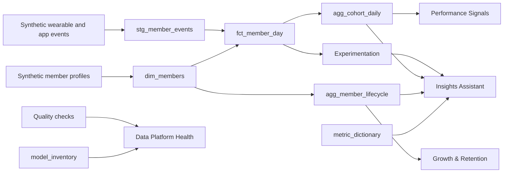

# Member Insights Lakehouse

A compact, production-minded analytics application for turning generated privacy-safe wearable and app events into trusted member insights. The project shows how a data engineering team can model high-volume behavioral and physiological signals into reliable metrics for product analytics, experimentation, member insights, and AI-assisted workflows.

All data is generated for privacy-safe development. This project does not use or imply access to any private company, product, or member data.

## Vision

Modern health and performance products depend on more than raw events. Teams need durable data contracts, explainable metrics, quality controls, and fast ways for product, analytics, and ML partners to ask better questions about member behavior.

The vision for this project is a small but realistic member-insights platform:

- ingest wearable and app events as immutable facts,
- model those events into member-day and cohort-level analytical tables,
- enforce data quality before metrics reach dashboards,
- expose governed metric definitions,
- and use AI only on trusted aggregates and documented business logic.

The goal is to show how a compact analytics application can still reflect production-grade habits: clear table grains, validation, observability, metric governance, and privacy-aware AI boundaries.

## Who It Is Built For

This application is built for the kinds of teams that need to make member behavior understandable and actionable:

- **Data engineering teams** building reliable ELT pipelines, metric marts, and platform observability.
- **Analytics and product teams** measuring recovery, sleep, strain, engagement, cohort behavior, and experimentation outcomes.
- **Data science and ML partners** who need clean, documented, ML-ready member-day features.
- **Engineering managers and technical leads** evaluating whether a data platform can scale from local implementation to production.

## What It Shows

The app has six views:

- **Growth & Retention:** new members, retention rate, subscription continuity, acquisition channels, and segmentation by plan/gender/cohort.
- **Performance Signals:** cohort trends for recovery, sleep, strain, engagement, low-recovery risk, and a deterministic AI-style explanation of metric movement.
- **Experimentation:** algorithm-release comparison for baseline vs release-candidate groups, recovery lift, sleep lift, engagement lift, and guardrail movement.
- **Data Platform Health:** pipeline status, table row counts, freshness, model inventory, and quality-check pass rate.
- **Metric Dictionary:** governed definitions and source logic for the metrics shown in the dashboard.
- **Insights Assistant:** governed natural-language Q&A over curated analytical functions, with contextual chart responses and trace metadata for growth, retention, subscription continuity, segmentation, experimentation, platform health, metric definitions, and performance signals.

The underlying model covers common analytical table patterns:

- **Event table:** `stg_member_events`, immutable wearable and app events.
- **Dimension table:** `dim_members`, member cohort, plan, goal, and demographic attributes.
- **Fact table:** `fct_member_day`, one row per member per day for analytics and ML features.
- **Aggregate table:** `agg_cohort_daily`, cohort-level trusted metrics for dashboards and AI explanations.
- **Lifecycle aggregate:** `agg_member_lifecycle`, member growth, retention, continuity, and segmentation metrics.
- **Experiment aggregate:** `agg_experiment_daily` and `agg_experiment_summary`, algorithm-release variant outcomes and lift metrics.
- **Audit table:** `pipeline_run_log`, run status and modeled table counts.
- **Model inventory:** `model_inventory`, table grains, types, and row counts for platform health.
- **Metric dictionary:** `metric_dictionary`, definitions and source logic for governed analytics.

## Why This Matters

Modern member-based health and performance products depend on scalable ELT, Python/PySpark, Snowflake-style warehousing, dbt-style modeling, Kafka/Spark-style event processing, reliability, observability, experimentation support, and data systems that power member insights. This project mirrors that problem shape in a runnable local environment:

- raw wearable/app signals become trusted member analytics,
- event data is transformed into clean member-day facts and cohort marts,
- quality checks protect downstream metrics,
- observability is treated as part of the data product,
- and AI is framed as a governed assistant over curated metrics, not a shortcut around data modeling.

This is intentionally compact, but the design choices reflect how the same system could evolve in a production data platform.

## Technology Stack

Built locally with:

- **Python:** privacy-safe data generation, orchestration script, and quality checks.
- **DuckDB:** local analytical warehouse for fast iteration.
- **SQL:** dbt-style transformations and table modeling.
- **Streamlit:** interactive dashboard and application surface.
- **Altair/Pandas:** visualizations and lightweight analytical processing.

Mirrors a production environment with:

- **Kafka or Kinesis:** wearable, app, journal, and product-event ingestion.
- **Spark/PySpark:** high-volume batch and streaming processing.
- **Snowflake:** analytical serving layer for product analytics, experimentation, and trusted metrics.
- **dbt:** model DAG, tests, documentation, metric contracts, and CI checks.
- **AWS:** S3 landing zones, Glue catalog, Lambda/Step Functions for lightweight workflows, and CloudWatch for logs and alerts.
- **Observability tooling:** freshness, schema drift, row-count anomalies, failed checks, and metric SLAs.
- **Approved AI tooling:** natural-language explanations and visual responses over curated aggregate tables and documented metric definitions, with function routing before any generative interpretation.
- **GitHub Actions keep-alive:** scheduled app wake-up checks for Streamlit Community Cloud deployments.

## Architecture



## Project Structure

```text
member-insights/
  app.py                  # Single-page Streamlit app and tab flow
  generate_synthetic_data.py
  requirements.txt
  CHANGELOG.md
  docs/ENGINEERING_NOTES.md
  src/
    data.py               # DuckDB access and quality-check adapter
    metrics.py            # Governed calculations and assistant router
    ui.py                 # Shared CSS, labels, cards, and chart styling
  sql/01_build_models.sql
  tests/run_quality_checks.py
  .streamlit/config.toml # Streamlit dark theme configuration
  .github/workflows/keep-alive.yml
  data/
```

For a portfolio-style project narrative, see [docs/CASE_STUDY.md](docs/CASE_STUDY.md). Engineering design notes live in [docs/ENGINEERING_NOTES.md](docs/ENGINEERING_NOTES.md), and release history is tracked in [CHANGELOG.md](CHANGELOG.md).

## Run Locally

```bash
pip install -r requirements.txt
python generate_synthetic_data.py
python tests/run_quality_checks.py
streamlit run app.py
```

The Insights Assistant does not require hosted APIs, API keys, or local model services. It routes natural-language prompts to governed analytical functions, returns precise text plus contextual charts when useful, and displays an analysis trace with selected tool, estimated tokens, rows considered, latency, API calls, and API cost.

## Quality Checks

The project includes checks for:

- duplicate event IDs,
- null member IDs,
- recovery score bounds,
- heart-rate bounds,
- one-row-per-member-per-day fact grain,
- recent data freshness,
- accepted member status and gender values,
- lifecycle rate bounds,
- experiment assignment uniqueness,
- accepted experiment variants,
- experiment summary population,
- and model inventory population.

## Project Checkpoint

As of 2026-05-27, the project is in a stable public checkpoint state:

- the six-tab Streamlit application is implemented and browser-verified,
- generated data and DuckDB models are in place,
- 13 quality checks are passing,
- the governed visual assistant answers natural-language questions with precise text, contextual charts, and trace metadata,
- README, changelog, project tracker, engineering notes, and case study documentation are aligned,
- current public checkpoint: application, documentation, and repository hygiene are aligned.

## 90-Second Walkthrough

1. "I built this as a small version of a member-insights platform: raw wearable and app events becoming reliable product analytics."
2. "The model starts with immutable event data, joins member dimensions, then creates member-day facts, cohort aggregates, and lifecycle marts."
3. "The dashboard answers growth, retention, subscription continuity, experimentation, recovery, sleep, strain, engagement, and platform-health questions from governed tables."
4. "The assistant is deliberately governed. It routes natural-language prompts to curated analytical functions, shows its analysis trace, and avoids external API limits."
5. "In production I would move this to Kafka/Spark/Snowflake/dbt, add orchestration and observability, and treat data quality and metric governance as part of the product experience."

## What This Demonstrates About My Approach

- I can translate role and business context into a working analytics product quickly.
- I model data around business questions, not just technical pipelines.
- I care about grain, quality, observability, documentation, and production migration paths.
- I use AI as an accelerator while preserving governance, explainability, and data boundaries.
- I can connect wearable telemetry, product analytics, and member-facing insights because I have worked on similar high-volume health-signal systems before.
