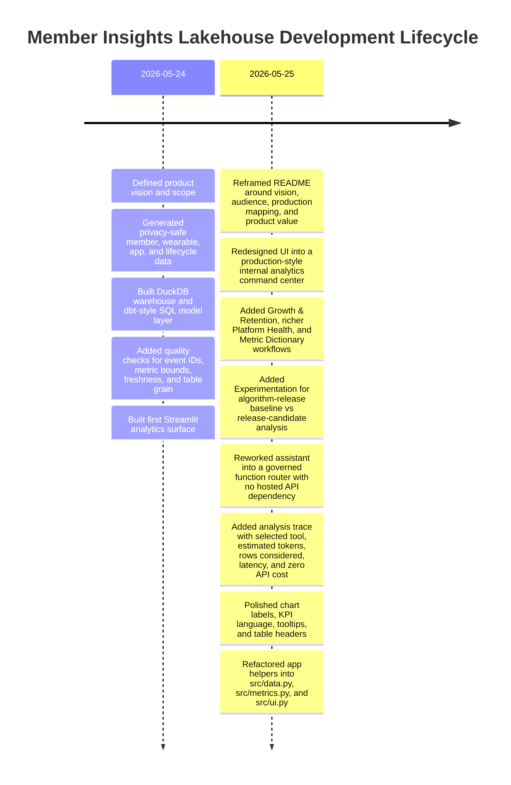
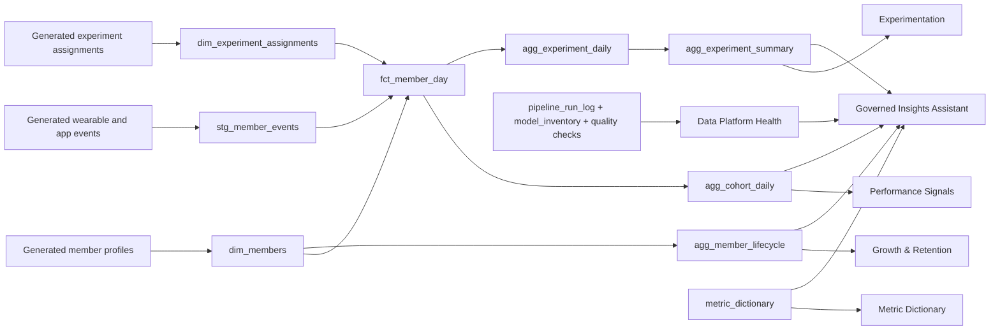

# Member Insights Lakehouse Case Study

## Overview

Member Insights Lakehouse is a production-minded analytics application for transforming wearable, app, lifecycle, and experimentation events into trusted member insights. It combines data modeling, data quality, observability, metric governance, experimentation analytics, and a governed natural-language assistant in one self-contained analytical product.

The application is designed around a realistic internal data platform pattern: raw event streams land as immutable facts, warehouse models turn them into reliable analytical tables, quality gates protect downstream use, and business-facing users consume metrics through dashboards, dictionaries, and governed AI-assisted workflows.

## Product Goals

- Turn high-volume event data into reliable member-day, cohort, lifecycle, and experiment marts.
- Make member growth, retention, subscription continuity, recovery, sleep, strain, engagement, and algorithm-release outcomes easy to inspect.
- Treat pipeline health, freshness, quality checks, and model inventory as part of the data product experience.
- Provide natural-language access to trusted metrics without allowing unrestricted SQL generation or ungrounded answers.
- Keep the system compact enough to run locally while preserving production migration paths to Kafka/Kinesis, Spark, Snowflake, dbt, AWS, and observability tooling.

## Lifecycle Timeline

## Delivery Phases

| Phase | Outcome | Evidence |
| --- | --- | --- |
| Product Framing | Defined the platform vision, users, workflows, and production mapping. | README vision, audience, architecture, and walkthrough sections. |
| Data Generation | Created privacy-safe member, wearable, app, lifecycle, and experiment datasets. | `generate_synthetic_data.py`, `data/`, and DuckDB warehouse artifact. |
| Data Modeling | Built staging, dimension, fact, aggregate, audit, model inventory, experiment, and metric dictionary tables. | `sql/01_build_models.sql`. |
| Quality & Observability | Added quality checks and platform health metrics for freshness, row counts, model inventory, and check pass rate. | `tests/run_quality_checks.py`, `pipeline_run_log`, `model_inventory`, Data Platform Health tab. |
| Product Analytics | Added member growth, retention, subscription continuity, acquisition, performance, and experimentation analytics. | Growth & Retention, Performance Signals, and Experimentation tabs. |
| Governed AI Workflow | Built natural-language Q&A over governed analytical functions with trace metadata and zero external API cost. | Insights Assistant tab and `src/metrics.py`. |
| UX Polish | Cleaned chart labels, tooltips, KPI wording, axis readability, card layout, and visual hierarchy. | Streamlit UI, `src/ui.py`, changelog. |
| Code Organization | Refactored shared logic into data, metrics, and UI modules while keeping the app as a single clear product surface. | `app.py`, `src/data.py`, `src/metrics.py`, `src/ui.py`. |

## Decision Log

| Decision | Rationale | Tradeoff |
| --- | --- | --- |
| Keep one Streamlit page with tabs | The product is easier to scan as one internal analytics surface. Shared filters, status, and context remain visible across workflows. | A larger long-lived app may eventually benefit from separate pages. |
| Extract helpers into `src/` modules | Keeps `app.py` readable while preserving a simple one-page user experience. | Adds a small amount of project structure. |
| Use DuckDB locally | Enables fast local iteration and reproducible analytics without external infrastructure. | Production deployment would move the same model pattern to Snowflake or another warehouse. |
| Use dbt-style SQL models | Makes table grain, transformation logic, and warehouse migration paths easy to discuss and inspect. | Does not include a full dbt project scaffold yet. |
| Use generated privacy-safe data | Preserves realistic analytical shape without using private company, product, or member data. | Metrics are representative rather than sourced from a real production system. |
| Build a governed assistant router | Gives users natural-language answers without hosted API limits, local model setup, or hallucinated metrics. | It is deterministic and tool-routed rather than a fully generative assistant. |
| Add experimentation analytics | Shows how member insights can support algorithm-release validation, guardrails, and product analytics. | Statistical inference is intentionally lightweight in the current version. |
| Treat platform health as a first-class tab | Shows that metric trust depends on pipeline freshness, quality gates, and model inventory. | Uses local audit tables instead of external observability systems. |

## Architecture

## Validation Strategy

- Event identity checks prevent duplicate raw events.
- Null checks protect required member keys.
- Accepted-value checks validate member status, gender, and experiment variants.
- Bounds checks protect recovery and heart-rate ranges.
- Grain checks ensure one row per member per day in the fact table.
- Freshness checks verify that recent data is available.
- Lifecycle rate checks ensure retention and continuity metrics stay within valid percentage ranges.
- Experiment checks verify unique assignments and populated experiment summaries.
- Model inventory checks confirm that modeled tables are visible to the platform-health layer.

## Production Evolution

| Local Implementation | Production Direction |
| --- | --- |
| CSV event generation | Kafka/Kinesis event ingestion with schema contracts |
| DuckDB warehouse | Snowflake analytical warehouse |
| SQL model file | dbt model DAG, docs, tests, exposures, and CI |
| Python quality checks | dbt tests, Great Expectations, warehouse assertions, and alerting |
| Streamlit application | Internal analytics application or BI serving layer |
| Governed function router | Approved AI assistant with tool calling, retrieval, evaluation, and audit logs |
| Local pipeline audit table | CloudWatch, Datadog, orchestration metadata, and metric SLAs |

## Final State

The project now operates as a compact member-insights platform with:

- a clear business-facing analytics surface,
- reliable table grains and modeled data products,
- quality gates and platform-health visibility,
- experimentation support for algorithm-release analysis,
- governed metric definitions,
- natural-language analytics with traceable tool routing,
- and maintainable code organization across `app.py`, `src/data.py`, `src/metrics.py`, and `src/ui.py`.

