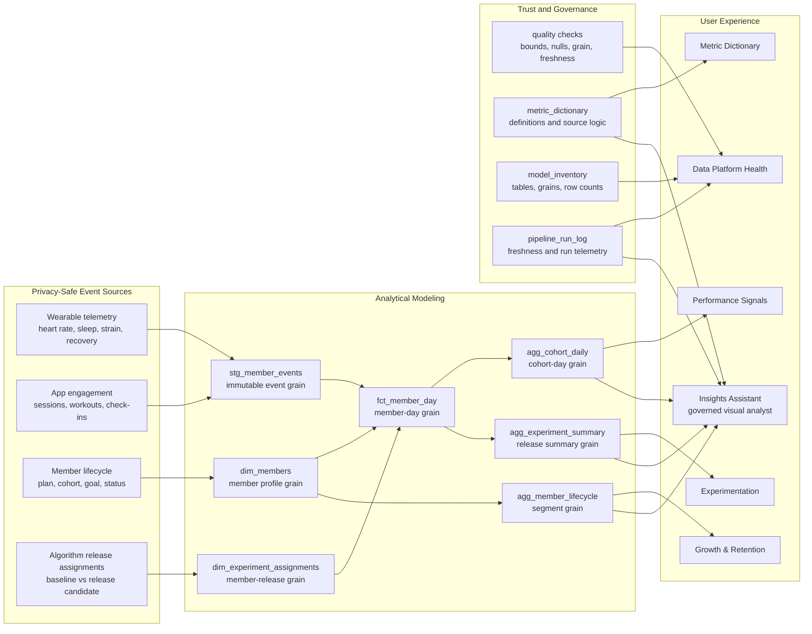
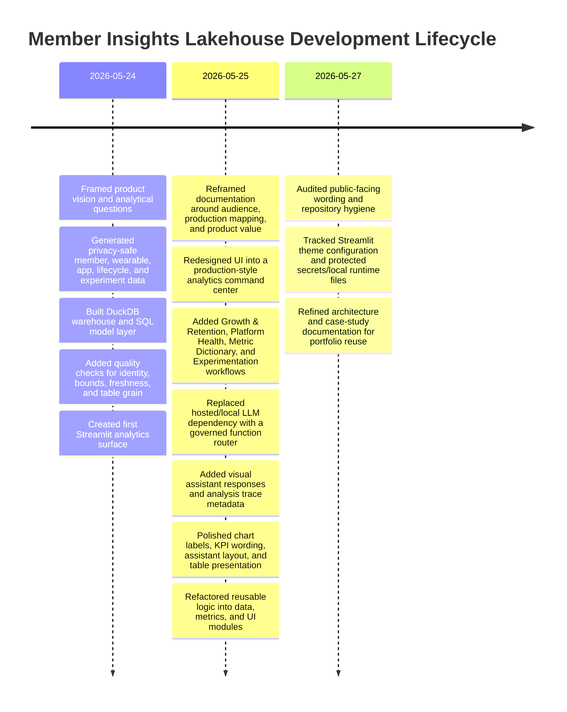

# Member Insights Lakehouse Case Study

## Executive Summary

Member Insights Lakehouse is a production-minded analytics application for transforming wearable, app, lifecycle, and experimentation events into trusted member insights. It is built around the kind of data product a member-based health, fitness, or performance company would need internally: reliable event modeling, cohort analytics, experiment readouts, platform-health visibility, governed metric definitions, and natural-language analysis over trusted tables.

The application is intentionally compact, but the architecture mirrors a larger production system. Raw event streams are modeled into member-day facts, lifecycle marts, cohort aggregates, experiment summaries, quality gates, and metric dictionaries. The product surface then gives analytics, product, engineering, and data science teams a shared place to inspect growth, retention, recovery, sleep, strain, engagement, release outcomes, and data reliability.

## Product Problem

High-volume member products create a constant stream of behavioral and physiological signals. Those signals are valuable only when teams can trust the definitions, table grain, freshness, and quality controls behind the metrics.

The core product problem is not simply "show a dashboard." It is:

- turn event-heavy member data into stable analytical tables,
- make growth, retention, performance, and experimentation metrics easy to inspect,
- expose data reliability alongside business metrics,
- give stakeholders natural-language access without allowing ungoverned SQL or invented answers,
- and preserve a clear migration path from local implementation to production-grade infrastructure.

## Target Users

| User | What They Need |
| --- | --- |
| Product and analytics teams | Growth, retention, subscription continuity, cohort movement, release impact, and metric explanations. |
| Data engineering teams | Clear table grains, reliable transformations, quality gates, model inventory, freshness, and observability. |
| Data science and ML partners | Member-day features and documented analytical tables that can support modeling and experimentation. |
| Engineering leaders | Evidence that the data product can scale from a compact implementation to governed production workflows. |

## Product Surface

The application is organized as one Streamlit product surface with six focused workflows:

| View | Purpose |
| --- | --- |
| Growth & Retention | Tracks new members, active members, 30-day retention, subscription continuity, acquisition channels, and plan/gender/cohort segmentation. |
| Performance Signals | Shows recovery, sleep, strain, engagement, and low-recovery risk trends from member-day facts. |
| Experimentation | Compares baseline and release-candidate algorithm groups with outcome and guardrail metrics. |
| Data Platform Health | Surfaces pipeline status, freshness, raw event volume, quality pass rate, model inventory, and modeled table counts. |
| Metric Dictionary | Documents governed definitions and source logic for metrics used across the app. |
| Insights Assistant | Routes natural-language questions to governed analytical functions and returns precise text, contextual charts, and trace metadata. |

## Architecture

## Data Model

| Layer | Table | Grain | Why It Exists |
| --- | --- | --- | --- |
| Staging | `stg_member_events` | One event per member event | Preserves immutable wearable and app-event history for downstream modeling. |
| Dimension | `dim_members` | One row per member | Provides cohort, plan, goal, demographic, acquisition, and lifecycle attributes. |
| Dimension | `dim_experiment_assignments` | One assignment per member | Supports baseline vs release-candidate analysis for algorithm updates. |
| Fact | `fct_member_day` | One row per member per day | Creates ML-ready and dashboard-ready daily features from raw event signals. |
| Aggregate | `agg_cohort_daily` | One row per cohort per day | Powers performance trends for recovery, sleep, strain, engagement, and risk. |
| Aggregate | `agg_member_lifecycle` | One row per segment | Powers growth, retention, subscription continuity, and segmentation analysis. |
| Aggregate | `agg_experiment_summary` | One row per experiment | Summarizes lift and guardrail movement for release validation. |
| Governance | `metric_dictionary` | One row per metric | Keeps definitions and source logic explicit for dashboard and assistant use. |
| Observability | `pipeline_run_log`, `model_inventory` | One row per run/table | Makes data freshness, table inventory, and row counts visible to users. |

## Governed AI Strategy

The Insights Assistant is designed as a governed visual analyst rather than a free-form LLM dependency. This was a deliberate product and engineering choice.

The assistant:

- accepts natural-language questions,
- routes each question to a curated analytical function,
- answers from modeled aggregate tables and metric definitions,
- attaches charts when a visual answer is useful,
- and displays trace metadata such as selected tool, estimated tokens, rows considered, latency, API calls, and API cost.

This provides the user experience of natural-language analytics while avoiding the most common failure modes in analytical AI products: arbitrary SQL generation, hallucinated definitions, private data exposure, API quota failures, and untraceable answers.

## Key Product Decisions

| Decision | Rationale | Tradeoff |
| --- | --- | --- |
| Keep one Streamlit page with tabs | A product stakeholder can understand the full data product quickly without navigating through multiple pages. | A larger maintained product could later split into pages. |
| Model member-day facts before aggregates | Member-day grain is the right bridge between raw wearable events, dashboards, experimentation, and ML features. | Requires more modeling discipline than charting directly from raw events. |
| Add platform health as a first-class workflow | Metric trust depends on freshness, quality checks, and model inventory, not only business charts. | Uses local observability artifacts instead of full production orchestration metadata. |
| Use baseline vs release-candidate language | This is more readable for product and engineering stakeholders than only control/treatment terminology. | Statistical inference is intentionally lightweight in the current version. |
| Build a governed assistant router | Natural-language access works without API keys, local model setup, hosted API limits, or hallucinated SQL. | The assistant is constrained to approved analytical routes rather than unlimited free-form analysis. |
| Show trace metadata | Makes AI-assisted analysis auditable and production-minded. | Token counts are estimated because the current assistant does not call a hosted model. |

## Validation Strategy

The project includes 13 quality checks covering:

- duplicate event IDs,
- required member identifiers,
- recovery score bounds,
- heart-rate bounds,
- one-row-per-member-per-day fact grain,
- recent data freshness,
- accepted member status values,
- accepted gender values,
- lifecycle percentage bounds,
- model inventory population,
- unique experiment assignments,
- accepted experiment variants,
- and populated experiment summaries.

Quality is intentionally visible in the product through the Data Platform Health workflow. That makes data reliability part of the user experience instead of a hidden engineering concern.

## Production Evolution

| Current Implementation | Production Direction |
| --- | --- |
| Generated privacy-safe CSVs | Kafka/Kinesis event ingestion with schema contracts and event versioning. |
| DuckDB analytical warehouse | Snowflake or a cloud warehouse serving governed marts. |
| SQL model file | dbt model DAG with tests, docs, exposures, metric contracts, and CI. |
| Python quality checks | dbt tests, Great Expectations, warehouse assertions, and alerting. |
| Streamlit application | Internal analytics app, product analytics surface, or BI serving layer. |
| Governed function router | Approved AI assistant with tool calling, retrieval, evaluation, access controls, and audit logs. |
| Local pipeline audit table | Orchestration metadata, CloudWatch/Datadog telemetry, freshness SLAs, and incident alerts. |

## Development Lifecycle

## Portfolio Narrative

This project demonstrates a practical data engineering and analytics engineering approach:

- start from the business questions,
- design the right table grains,
- build metric marts that support both dashboards and AI workflows,
- make reliability visible through platform health,
- keep metric definitions governed,
- and design natural-language analytics around trusted functions instead of unrestricted generation.

The strongest walkthrough path is:

1. Open with the problem: member products need trusted insights from high-volume event data.
2. Show Growth & Retention to establish business value.
3. Show Experimentation to demonstrate product analytics and release validation.
4. Show Data Platform Health to prove that metric trust is treated as part of the product.
5. Show Insights Assistant with chart and analysis trace to highlight governed AI over curated metrics.
6. Close with the production evolution: Kafka/Kinesis, Spark, Snowflake, dbt, AWS observability, and approved AI tooling.

## Final State

As of 2026-05-27, the project is in a stable public checkpoint state:

- six Streamlit workflows are implemented,
- generated privacy-safe data and DuckDB models are in place,
- 13 quality checks are passing,
- the assistant answers natural-language questions with text, contextual charts, and trace metadata,
- documentation is aligned for portfolio case-study reuse,
- and remaining work is optional presentation polish, such as adding screenshots from the live application.
